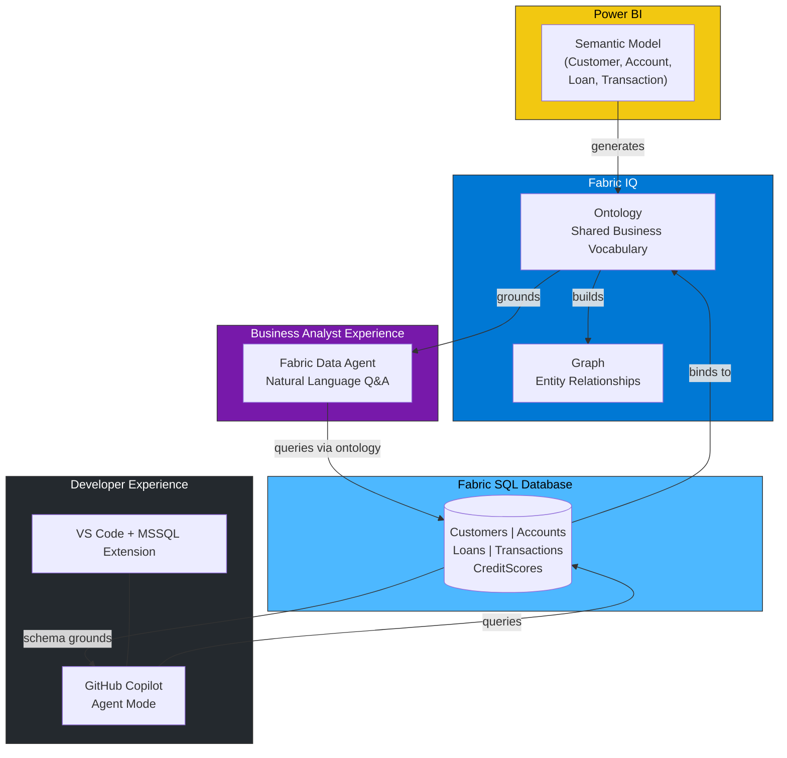
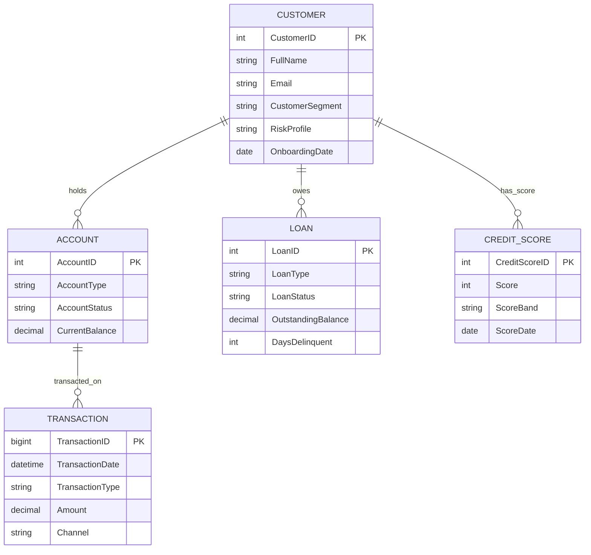
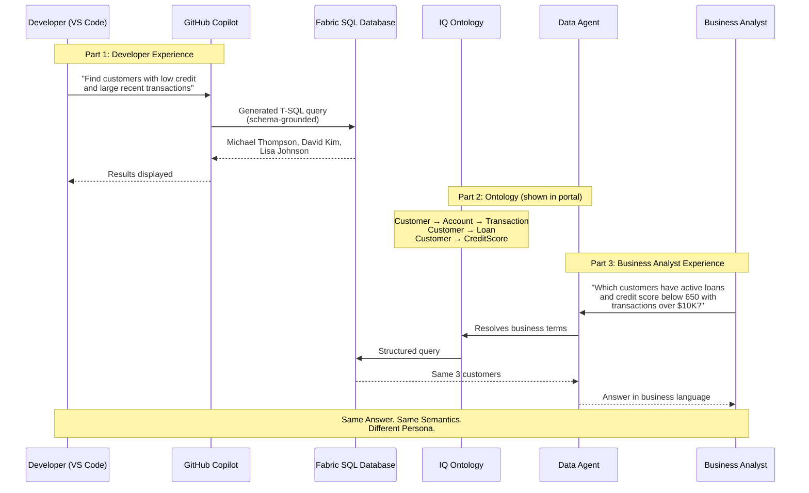
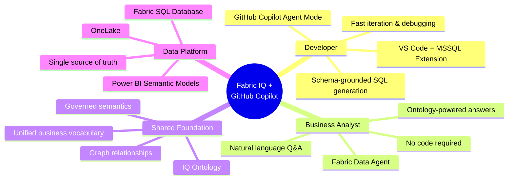

# Architecture Diagrams for Video

Use these Mermaid diagrams as overlays or title cards in the demo video.

## Main Architecture — Integration Flow

## Ontology Entity Relationship Diagram

## Demo Flow Sequence

## Title Card — Value Proposition

